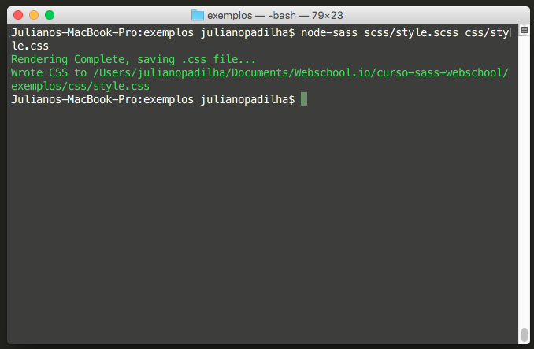

# Aula 1 - Introdução

## SASS - Syntactically Awesome Style Sheets

### Requisitos básicos:

- CSS
- NPM

### Sobre SASS

O pré-processador Sass(Syntactically Awesome Stylesheet) foi criado em 2006 por desenvolvedores Ruby com o objetivo de aumentar a produtividade ao codificar CSS, a grosso modo, o Sass estende o CSS, fornecendo mecanismos disponíveis em linguagens de programação mais tradicionais que não estão disponíveis no CSS, através destes mecanismos, como variáveis, loops, funções e etc, é possível produzir o código de forma rápida, com manutenção fácil, prática e de baixo custo.

A implementação oficial do Sass é open-source e codificada em Ruby, no entanto, existem várias implementações em outras linguagens como Python, Java, PHP, JavaScript e muitas outras, desenvolvidas através da biblioteca LibSass. Neste curso utilizaremos o módulo node-sass do Node, para compilar nossos arquivos Sass.

### D.R.Y - Don't Repeat Yourself

O conceito de D.R.Y está muito relacionado com o SASS. Pois SASS foi criado visando a não repetição.

### Pré-processadores

O Sass precisa ser pré-processado antes de gerar o CSS que será renderizado pelo navegador, logo, o navegador nunca renderiza o código Sass diretamente, por este motivo utilizaremos o node-sass, este módulo compila o arquivo Sass e salva o resultado em um arquivo CSS que será renderizado pelo navegador.

### Instalação

Para utilizar o módulo node-sass, você precisa do Node.js instalado no seu computador.

`sudo apt-get install nodejs`

A seguir instalaremos o gerenciador de pacotes npm, ele permitirá instalar facilmente módulos e pacotes para utilizar com o Node.js.

`sudo apt-get install npm`

Finalmente instalamos o node-sass globalmente

`npm install -g node-sass`

Agora o ambiente está pronto para utilizarmos o Sass!

### .sass e .scss

Você pode usar o Sass com duas sintaxes: o .sass, arquivo baseado em indentação e o .scss que funciona como o CSS, usando chaves para denotar blocos de código e ponto e vírgula para separar linhas dentro de um bloco.

Observe os exemplos abaixo:

**.sass**

body
  color: #333

**.scss**

body {
  color: #333;
}

### Criando um arquivo Sass

Para criar um arquivo Sass, basta criar um novo arquivo e salvá-lo com a extensão .scss ou .sass. Utilize o bloco abaixo para seguir o primeiro exemplo, salve como exemplo.scss ou exemplo.sass.

body {
  color: #333;
}

### Compilando um arquivo Sass

Você pode compilar um arquivo por vez ou uma pasta, entenda o comando.

`node-sass entrada saída`

Vamos compilar nosso exemplo:

`node-sass exemplo.scss exemplo.css`

Para compilar uma pasta inteira utiliza-se:

`node-sass sass/ -o css/`

Os arquivos da pasta sass serão compilados e salvos na pasta css

#### "Espiando" alterações

`node-sass --watch exemplo.scss exemplo.css`

Espiando as alterações processa os arquivos sass assim que forem salvos.
